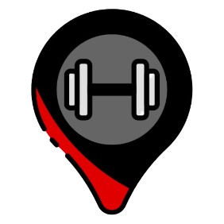

  

# GymHub - Platform for physical evolution and monitoring

This project was carried out individually without the help of Artificial Intelligence, simply following the guidance of professors at São Paulo Tech School, and was the delivery of one of the works carried out in the first semester.

--- 

## Objective

Help individuals who frequent gyms to directly observe their progress, showing a follow-up of gains in relation to previous months, so that the results become even more visible, even if in small proportions, generating an increase in relation to expectations and increasing the willpower of those who practice physical activities.

## Features

GymHub contains some key features:

1. **Body mass index calculator:**
